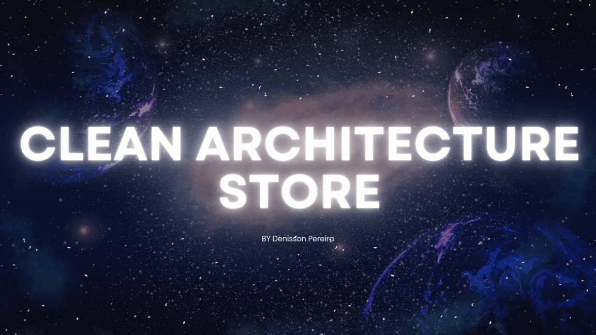

# clean-architecture-store
 
 

<p align="center">
  <a href="https://github.com/Denisson-Pereira/clean-architecture-store"></a>
  <a href="https://github.com/Denisson-Pereira/clean-architecture-store/issues"></a>
  <a href="https://github.com/Denisson-Pereira/clean-architecture-store/graphs/contributors"></a>
  <a href="https://github.com/Denisson-Pereira/clean-architecture-store/commits/main"></a>
  <a href="https://github.com/Denisson-Pereira/clean-architecture-store/stargazers"></a>
</p>

# 📝 Sumário

1. [Sobre o Projeto](#-sobre-o-projeto)
2. [Arquitetura de software](#-arquitetura-de-software)
   - [Sobre](#-sobre)
   - [Sobre a Clean Architecture](#-sobre-a-clean-architecture)
3. [Stack Tecnológica e Descrições](#-stack-tecnológica-e-descrições)
   - [Backend](#-backend)
        - [Princípios SOLID](#-princípios-solid)
        - [Design patterns](#-design-patterns)
        - [Estrutura do Banco de Dados](#-estrutura-do-banco-de-dados)
   - [Frontend](#-frontend)
   - [Design](#-design)
4. [Pré-requisitos](#-pré-requisitos)
5. [Como Executar o Projeto](#-como-executar-o-projeto)
   - [Clonar Repositório Git](#-clonar-repositório-git)
   - [Acessar Backend](#-acessar-backend)
   - [Documentação](#-documentação)
6. [Visuals and Screenshots](#-visuals-and-screenshots)
   - [Software em Ação](#-software-em-ação)
7. [Edição](#-edição)   
8. [Aguarde! Ainda Não Terminou!](#-aguarde-ainda-não-terminou)
9. [Licença](#-licença)
10. [Autor](#-autor)

# 📑 Sobre o projeto 

O **Clean Architecture Store** é um projeto *full stack* baseado no modelo *client-server*, que adota a **Clean Architecture** e os princípios da **Programação Orientada a Objetos**. Desenvolvido com foco nas regras de negócio de um aplicativo de delivery de alimentos, o *back-end* foi implementado em **Java** com **Spring Boot**, enquanto o banco de dados utiliza **MySQL**. O *front-end* foi construído com **HTML**, **CSS** e **JavaScript**, proporcionando uma interface simples e eficaz. O código é projetado seguindo padrões de design e boas práticas, como a abstração de entidades, os princípios **SOLID** e a aplicação de **Design Patterns**.

Para garantir a segurança da aplicação, foram implementados mecanismos robustos como encapsulamento de dados, **Spring Security** para controle de acesso e criptografia de senhas com **BCrypt**. A autenticação dos usuários é feita por meio de **JWT** (*JSON Web Token*), que assegura a proteção e integridade das sessões autenticadas. Dessa forma, o projeto combina eficiência, segurança e organização, alinhando-se aos melhores padrões de desenvolvimento de software.

# 🏢 Arquitetura de software

## 📖 Sobre

Este projeto foi desenvolvido com base nos princípios da **Clean Architecture**, que visa criar uma estrutura de código organizada, modular e altamente escalável. **A Clean Architecture** promove a separação clara de responsabilidades entre camadas do sistema, mantendo o domínio da aplicação isolado de detalhes técnicos, como *frameworks* ou bancos de dados. Isso facilita a manutenção, testes e evolução da aplicação ao longo do tempo, permitindo a fácil adaptação a novas necessidades ou tecnologias.


No projeto, temos duas entidades principais que compartilham muitas características em comum: *Products* e *Categories*. Com isso em mente, foi projetada uma estrutura abstrata que permite o reuso de código e o fortalecimento da arquitetura. Essa estrutura é composta por camadas de *entities*, *useCases*, *exceptions*, *interfaces* e *controllers*, garantindo que os comportamentos comuns entre as entidades sejam implementados de forma padronizada e extensível. Assim, cada nova entidade pode herdar essa base, mantendo a consistência e a simplicidade do projeto, enquanto possibilita adaptações específicas de acordo com as necessidades de cada caso de uso.

## 🏢 Sobre a Clean Architecture

| **Camada**                        | **Descrição**                                                                                                                                                               |
|-----------------------------------|---------------------------------------------------------------------------------------------------------------------------------------------------------------------------|
| **Entities (Entidades)**          | Representam as regras de negócio e a lógica central do sistema, sendo independentes de frameworks externos e bibliotecas. Nesta aplicação, as entidades `Product` e `Category` são exemplos claros, onde foi aplicada a abstração para reuso e consistência. |
| **Use Cases (Casos de Uso)**      | Os casos de uso são responsáveis por orquestrar as interações entre as entidades e outros componentes da aplicação, executando ações específicas da lógica de negócio. No projeto, isso inclui operações como a adição de um produto ao carrinho ou a criação de uma nova categoria. |
| **Controllers (Controladores)**   | Fazem a interface entre a camada de entrada (web, dispositivos, etc.) e os casos de uso, processando requisições do usuário e convertendo os dados para serem utilizados pelos casos de uso. No projeto, o controle de requisições HTTP para manipulação de produtos e categorias é feito pelos controladores. |
| **Gateways (Interfaces Externas)**| Fornecem a comunicação com serviços externos, como bancos de dados ou APIs. A aplicação se comunica com o banco MySQL através de gateways que isolam os detalhes de implementação da camada de persistência. |
| **Presenters (Apresentadores)**   | São responsáveis por preparar e formatar os dados para serem exibidos, como na interface do usuário (UI) ou via APIs. Eles traduzem a resposta dos casos de uso para um formato que o front-end ou sistemas externos possam consumir. |
| **External Interfaces (Interfaces Externas)** | São serviços, APIs ou bibliotecas externas que interagem com o sistema, como gateways de pagamento ou serviços de busca de produtos. Essa camada lida com essas integrações de forma isolada das regras de negócio centrais. |

# 📚 Stack Tecnológica e Descrições

## • Backend

[](https://www.java.com/)

[](https://spring.io/)


O backend deste projeto foi desenvolvido com o objetivo de fornecer dados para uma loja de comidas, além de garantir uma autenticação segura para os usuários. Utilizando **Java** e **Spring Boot**, a aplicação oferece uma estrutura robusta e escalável, permitindo gerenciar produtos, categorias e usuários de forma eficiente. A documentação da **API** foi realizada utilizando o **Swagger**, facilitando a compreensão e a interação com os endpoints disponíveis, promovendo uma experiência de desenvolvimento mais fluida e organizada.

### 🏢 Princípios SOLID

A arquitetura deste projeto é fortemente influenciada pelos princípios SOLID, que promovem um design de software limpo e sustentável. Abaixo estão os princípios observados na aplicação:

**1. Princípio da Responsabilidade Única (SRP)**
Cada classe e módulo tem uma única responsabilidade:
- **Controladores** (ex: `AbstractController`) lidam exclusivamente com a lógica de controle e as interações de entrada e saída.
- **Repositórios** (ex: `JpaCategoryImpl`) se concentram em operações de persistência de dados.
- **Casos de uso** (ex: `CreateAbstractUseCase`, `DeleteByIdAbstractUseCase`) gerenciam a lógica de negócios específica, como criar ou deletar entidades.

**2. Princípio Aberto/Fechado (OCP)**
As classes estão abertas para extensão, mas fechadas para modificação:
- As classes abstratas (como `AbstractController`, `AbstractEntity` e `AbstractRepository`) permitem que você crie novas implementações ou classes que estendam seu comportamento sem modificar o código existente.

**3. Princípio da Substituição de Liskov (LSP)**
As subclasses devem ser substituíveis por suas superclasses:
- As classes que estendem `AbstractEntity`, como `Category`, podem ser utilizadas em qualquer lugar que um `AbstractEntity` seja esperado, sem que o comportamento do programa seja afetado negativamente.

**4. Princípio da Segregação de Interfaces (ISP)**
As interfaces devem ser específicas e não forçar classes a implementar métodos que não usam:
- A interface `AbstractRepository` define métodos que são relevantes para qualquer repositório que implemente a persistência de uma entidade, evitando a implementação de métodos desnecessários.

**5. Princípio da Inversão de Dependência (DIP)**
Dependências devem ser de abstrações, não de implementações concretas:
- As classes de casos de uso dependem de abstrações (interfaces como `AbstractRepository`) em vez de implementações concretas, facilitando a troca de implementações de repositórios e aumentando a testabilidade do código.

Esses princípios foram fundamentais para garantir que o sistema seja escalável, testável e de fácil manutenção.

### 💅 Design patterns

A aplicação adota vários padrões de design que contribuem para sua estrutura modular, escalável e de fácil manutenção. Os principais padrões observados são:

**1. Template Method**
O padrão Template Method é utilizado na classe `UpdateAbstractByIdUseCase`, onde o método `execute()` define o esqueleto da operação de atualização. As subclasses devem implementar o método `updateFields(T entity, DTO dto)`, permitindo que a lógica específica de atualização seja definida pelas classes concretas.

**2. Repository Pattern**
O padrão Repository é empregado através da interface `AbstractRepository`, que abstrai a lógica de acesso a dados. Isso permite que a aplicação interaja com o armazenamento de dados sem se preocupar com os detalhes da implementação.

### 💾 Estrutura do Banco de Dados

O banco de dados `foodhub` contém três tabelas principais: `category`, `product` e `user`.

### Tabela: category

| Campo   | Tipo         | Descrição                               |
|---------|--------------|-----------------------------------------|
| id      | bigint       | Identificador único da categoria        |
| name    | varchar(255) | Nome da categoria                       |
| image   | varchar(255) | URL da imagem da categoria              |

**Exemplo de Dados**:

| id | name    | image |
|----|---------|-------|
| 1  | Burger  | [Link](https://firebasestorage.googleapis.com/v0/b/foodhub-ba95f.appspot.com/o/categorias%2FMask%20Group.png?alt=media&token=d42d4657-9af1-4ac4-84e6-a2774c183cfd) |
| 2  | Donat   | [Link](https://firebasestorage.googleapis.com/v0/b/foodhub-ba95f.appspot.com/o/categorias%2FMask%20Group%20(1).png?alt=media&token=d6633fe5-d259-4a29-a53c-908de806be2e) |

### Tabela: product

| Campo          | Tipo         | Descrição                          |
|----------------|--------------|------------------------------------|
| id             | bigint       | Identificador único do produto      |
| name           | varchar(255) | Nome do produto                    |
| evaluation     | varchar(255) | Avaliação do produto               |
| description    | varchar(255) | Descrição do produto               |
| price          | varchar(255) | Preço do produto                   |
| category       | varchar(255) | Categoria do produto               |
| establishment   | varchar(255) | Estabelecimento onde o produto está disponível |
| image          | varchar(255) | URL da imagem do produto           |

**Exemplo de Dados**:

| id | name                       | evaluation | description                                      | price | category | establishment | image                                                                                                         |
|----|----------------------------|------------|--------------------------------------------------|-------|----------|---------------|---------------------------------------------------------------------------------------------------------------|
| 1  | Margherita Bliss           | 5          | A classic Margherita with fresh tomatoes...      | 49999 | pizza    | Subway        | [Link](https://firebasestorage.googleapis.com/v0/b/foodhub-ba95f.appspot.com/o/estabelecimentos%2FRed%20Pizza.png?alt=media&token=66048747-3137-49d2-849e-e7118683761a) |
| 2  | Pepperoni Supreme          | 4          | Pepperoni pizza loaded with spicy slices...      | 3999  | pizza    | Subway        | [Link](https://firebasestorage.googleapis.com/v0/b/foodhub-ba95f.appspot.com/o/estabelecimentos%2FChicken%20wailan.png?alt=media&token=21eb816b-f5b7-42a7-b134-b8144cb95ff6) |
| 3  | BBQ Chicken Delight        | 3          | Enjoy a BBQ Chicken pizza with tangy sauce...   | 1999  | pizza    | Jimmy John's  | [Link](https://firebasestorage.googleapis.com/v0/b/foodhub-ba95f.appspot.com/o/estabelecimentos%2FRed%20Pizza.png?alt=media&token=66048747-3137-49d2-849e-e7118683761a) |
| 4  | Veggie Garden Extravaganza | 2          | Indulge in a Veggie Delight with mushrooms...    | 4499  | pizza    | Jimmy John's  | [Link](https://firebasestorage.googleapis.com/v0/b/foodhub-ba95f.appspot.com/o/estabelecimentos%2FChicken%20wailan.png?alt=media&token=21eb816b-f5b7-42a7-b134-b8144cb95ff6) |

### Tabela: user

| Campo   | Tipo         | Descrição                               |
|---------|--------------|-----------------------------------------|
| id      | bigint       | Identificador único do usuário          |
| name    | varchar(255) | Nome do usuário                         |
| login   | varchar(255) | Login do usuário                        |
| password| varchar(255) | Senha do usuário                       |

**Exemplo de Dados**:

| id | name     | login    | password   |
|----|----------|----------|------------|
| 1  | Pereira     | denisson | $2a$10$T8ASa58EC2GxXAXePudFMOagO844O6zH6Y5dR0i1GDmKa4Il/1TFO |
| 2  | denisson | den      | $2a$10$8n5UdTlmQTbYHOb//j9vMucj9LEmXGSgsdGRUqsXKNBn0MFYFli96 |


## • Frontend


O *frontend* foi desenvolvido seguindo o padrão **MVC** (*Model-View-Controller*), onde a *view* foi implementada diretamente no **Spring Boot** utilizando **HTML5**, **CSS3** e **JavaScript**. Essa abordagem foi inspirada na **Clean Architecture**, buscando criar uma estrutura limpa e minimalista, evitando a dependência excessiva de *frameworks* e bibliotecas externas. O objetivo é garantir que a aplicação seja simples, escalável e duradoura, facilitando a manutenção e a evolução do sistema ao longo do tempo.

## • Design


[](https://canvas.instructure.com/)

O **Adobe Photoshop** foi empregado para a edição e manipulação de imagens, garantindo qualidade e profissionalismo. Além disso, **Figma** foi utilizado para criar protótipos e layouts, facilitando a visualização e a colaboração no design da interface. Para capturas de tela e materiais educacionais, recorreu-se ao **Canvas**, que oferece uma plataforma intuitiva para a criação e compartilhamento de conteúdos visuais.

# ⚙ Pré-requisitos

**Certifique-se de ter o o Java 17**

Antes de mais nada, é necessário verificar se o Java 17 está instalado em sua máquina. Você pode baixá-lo e instalá-lo a partir do site oficial da Oracle.


# 🚀 Como executar o projeto

## 👯 Clonar repositório git

```
git clone https://github.com/Denisson-Pereira/clean-architecture-store
```

## 🏧 Acessar Backend

Após clonar o repositório, para acessar o backend, basta digitar o seguinte comando no terminal:

```
cd backend
```

Lembre-se de que os dados estão localizados, a partir da raiz do projeto, em database/Dump20241015.sql


## 📱 Documentação

Para acessar a documentação da API, basta visitar a URL:

```
http://localhost:8080/swagger-ui/index.html#/
```

# 📸 Visuals and Screenshots

Dê uma espiada no nosso projeto em funcionamento e esclareça todas as suas dúvidas sobre como executá-lo!


## 💻 Software em Ação

 


# 📺 Edição

No desenvolvimento deste projeto, foram utilizados os seguintes editores:


# 🚨 Aguarde! Ainda não terminou!

>Este projeto está atualmente em desenvolvimento, e está sujeito a futuras atualizações e melhorias conforme evolui. Estamos trabalhando para torná-lo ainda mais robusto e funcional ao longo do tempo. Agradecemos sua paciência e interesse nesta fase inicial.

>Por fim, gostaríamos de ressaltar que este projeto é aberto a contribuições de qualquer pessoa interessada em colaborar. Se você tem ideias, sugestões ou melhorias para oferecer, sinta-se à vontade para participar do desenvolvimento do projeto. Juntos, podemos criar algo incrível e beneficiar a comunidade de forma colaborativa.


# 📜 Licença

[](https://github.com/Denisson-Pereira/clean-architecture-store/blob/main/LICENSE) 

# 📝 Autor 

Denisson Pereira Santos

<div align='center'> 
<a href="https://www.linkedin.com/in/denisson-pereira" target="_blank"></a> 
<a href="https://denissonpereira.com" target="_blank"></a> 
<a href="https://github.com/Denisson-Pereira" target="_blank"></a> 
<a href="https://www.instagram.com/denisson_pereira1?igshid=OGQ5ZDc2ODk2ZA%3D%3D&utm_source=qr" target="_blank"></a>
</div>&nbsp;&nbsp;